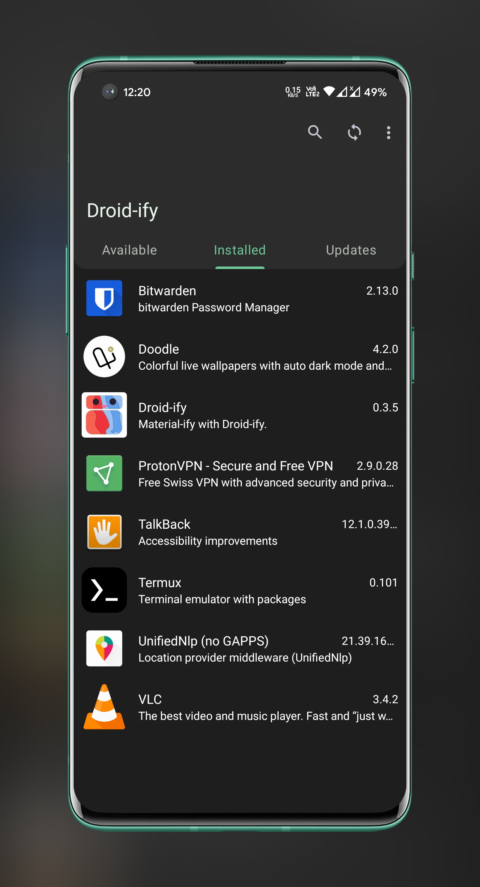
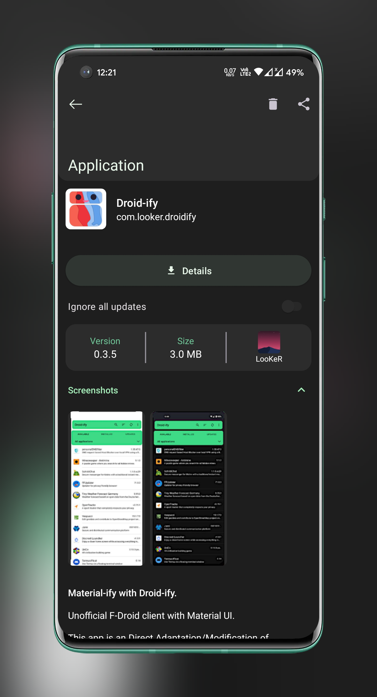

# Neo Store 

### A quick material F-Droid client.

[](https://github.com/Iamlooker/Droid-ify/stargazers)
[](https://github.com/Iamlooker/Droid-ify/blob/master/COPYING)
[](https://github.com/Iamlooker/Droid-ify/releases/)
[](https://github.com/Iamlooker/Droid-ify/releases/latest)
[](https://hosted.weblate.org/engage/droidify/?utm_source=widget)

[](https://android.izzysoft.de/repo/apk/com.looker.droidify)
[](https://f-droid.org/packages/com.looker.droidify)
[](https://t.me/neo_android_store)


## :book: Features

* :art: Material F-Droid style
* :dart: No cards or inappropriate animations
* :airplane: Fast repository syncing
* :wrench: Standard Android components and minimal dependencies

## :framed_picture: Screenshots

### :sun_with_face: Light

|  |  |
|:---------------------------------------------------------------------------------------------:|:--------------------------------------------------------------------------------------------:|

### :last_quarter_moon_with_face: Dark

|  |  |
|:--------------------------------------------------------------------------------------------:|:-------------------------------------------------------------------------------------------:|

### :waxing_crescent_moon: Black

|  |  |
|:----------------------------------------------------------------------------------------------:|:---------------------------------------------------------------------------------------------:|

## :building_construction: Building from source

Specify your Android SDK path either using the `ANDROID_HOME` environment variable, \
or by filling out the `sdk.dir` property in `local.properties`.

### :pen: Signing

Can be done automatically using `keystore.properties` as follows:

```properties
store.file=/path/to/keystore
store.password=key-store-password
key.alias=key-alias
key.password=key-password
```

### :hammer: Building

Run `./gradlew assembleRelease` to build a release package or run `./gradlew assembleDebug` if you want to build a debug APK.

All of these packages can be installed using the Android package manager.

## 👁️‍🗨️ Translations [](https://hosted.weblate.org/engage/droidify/?utm_source=widget)

Help translate Neo Store on [Hosted Weblate](https://hosted.weblate.org/engage/droidify/). \
[](https://hosted.weblate.org/engage/droidify/?utm_source=widget)

You can always add other languages.

## :scroll: Copylefted libre license

[GPLv3+](/COPYING). \
Direct adaptation/modification of [Foxy-Droid](https://github.com/kitsunyan/foxy-droid/) \
Copyright © 2020–2022 [Iamlooker](https://github.com/Iamlooker) and [contributors](https://github.com/Iamlooker/Droid-ify/graphs/contributors).
