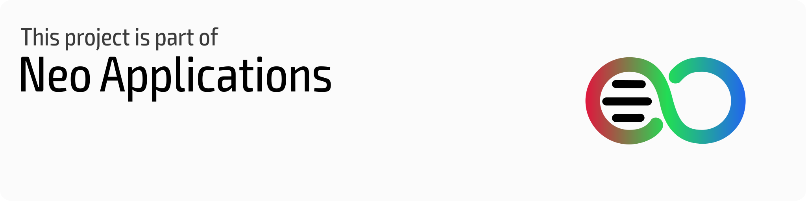
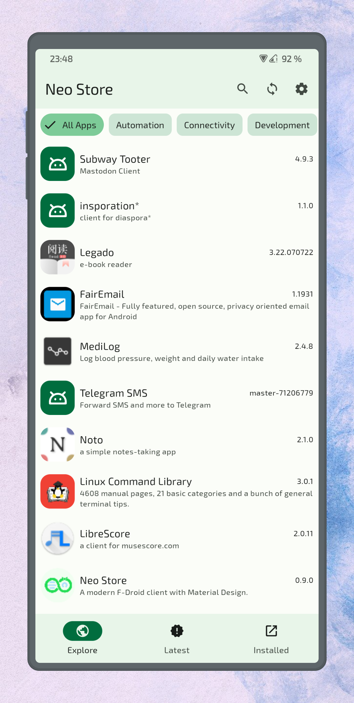
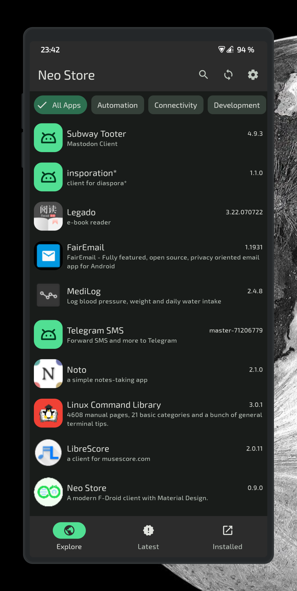
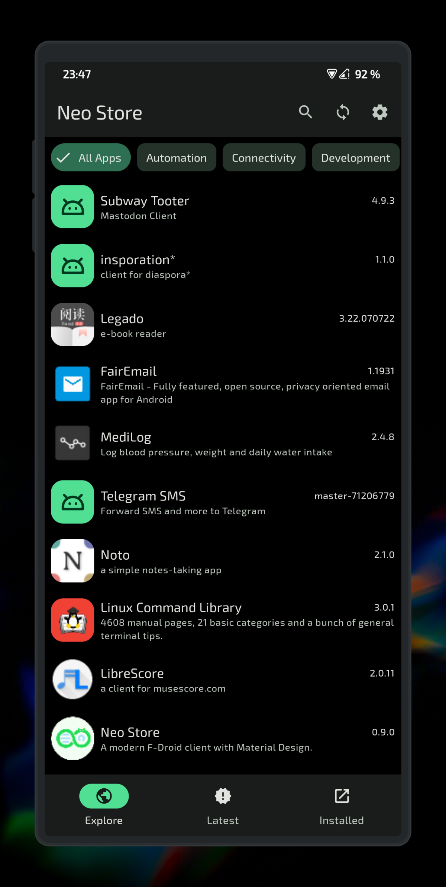
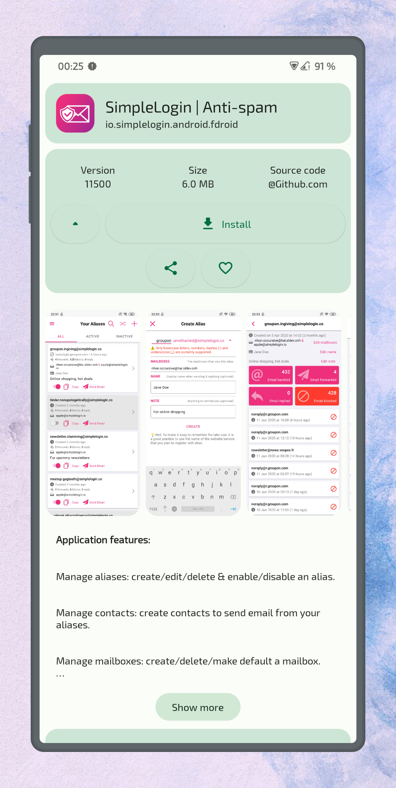
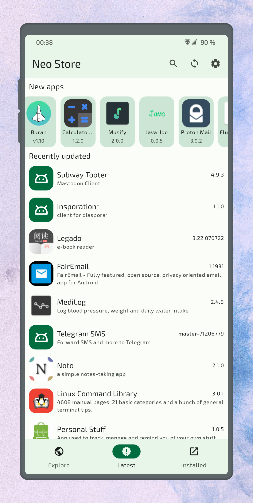
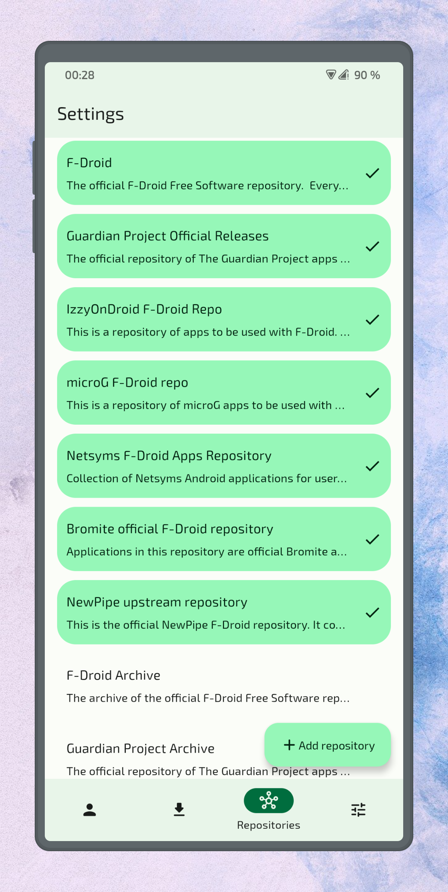

# Neo Store 

### The modern and feature-rich F-Droid client for everyone!

[](https://github.com/NeoApplications/Neo-Store/releases/latest)
[](https://github.com/NeoApplications/Neo-Store/releases/)
[](https://github.com/NeoApplications/Neo-Store/stargazers)
[](https://hosted.weblate.org/engage/neo-store/?utm_source=widget)
[](https://github.com/NeoApplications/Neo-Store/blob/master/COPYING)

[](https://f-droid.org/packages/com.machiav3lli.fdroid)
[](https://android.izzysoft.de/repo/apk/com.machiav3lli.fdroid)

[](https://github.com/NeoApplications)

## Features :abacus:

* UX focused on empowering users :fist:
* Fast repository sync times :airplane: 
* Awesome built-in repositories :toolbox:
* Easy exploration of new apps :mag:
* Minimalism with KISS principles :dart:

## Screenshots :framed_picture:

### Beautiful light :sun_with_face: and dark :new_moon_with_face: themes

|  |  |  |
|:-------------------------------------------------------------------------------------------------------:|:------------------------------------------------------------------------------------------------------:|:--------------------------------------------------------------------------------------------------------:|

### Complete app details, latest apps & built-in repos :toolbox:

|  |  |  |
|:-----------------------------------------------------------------------------------------------------:|:--------------------------------------------------------------------------------------------------------:| -------------------------------------------------------------------------------------------------------:|

## Community :speech_balloon:

You can join either our [Telegram](https://t.me/neo_android_store) or [Matrix](https://matrix.to/#/#neo-store:matrix.org) groups to make suggestions, ask questions, receive news, or just chat.

[](https://t.me/neo_android_store)

[](https://matrix.to/#/#neo-store:matrix.org)

## Translations :left_speech_bubble: [](https://hosted.weblate.org/engage/neo-store/?utm_source=widget)

Contribute your translations to Neo Store on [Hosted Weblate](https://hosted.weblate.org/engage/neo-store/). <br> Adding new languages is always accepted and supported.

[](https://hosted.weblate.org/engage/neo-store/?utm_source=widget)

## Building From Source :building_construction:

Specify your Android SDK path either by using the `ANDROID_HOME` environment variable, or filling out the `sdk.dir` property in `local.properties`.

### Signing :pen:

Can be done automatically using `keystore.properties` as follows:

```properties
store.file=/path/to/keystore
store.password=key-store-password
key.alias=key-alias
key.password=key-password
```

### Building :hammer:

Run `./gradlew assembleRelease` to build a release package or run `./gradlew assembleDebug` if you want to build a debug APK.

All of these packages can be installed using the Android package manager.

## Special Thanks :heart:

To [Iamlooker](https://github.com/Iamlooker), who worked with me on maintaining the project, until he had to step away and fork out out of career-related reasons. Best of luck!

## Copylefted Libre License :scroll:

Licensed with: [GPLv3+](/COPYING). \
Direct adaptation/modification of [Foxy-Droid](https://github.com/kitsunyan/foxy-droid/).

Copyright © 2023 [Antonios Hazim](https://github.com/machiav3lli) and [contributors](https://github.com/NeoApplications/Neo-Store/graphs/contributors).


