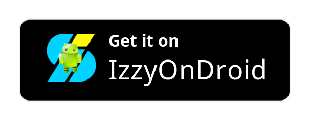

# Omega Launcher
Libre software launcher.  

## Installation
APKs are available on GitHub and in the Telegram channel. Some nightly builds
are only available in the Telegram channel. 

Nightly builds are now available at Github actions []
CAUTION: Nightly builds might be unstable.

F-Droid Repo: 
Download the current debug version by adding the following repo to the F-Droid App
[https://raw.githubusercontent.com/nonaybay/Omega/master/fdroid/repo](https://raw.githubusercontent.com/nonaybay/Omega/master/fdroid/repo)
## Community
You can join the Telegram channel to get nightly builds. There is also a Telegram group
to discuss the development, issues and new features. 

##  Working Features
-   [X] Five modes of sorting apps in the drawer.
-   [X] Google feed integration.
-   [X] Theme support.
-   [X] Customize search engine.
-   [X] Gesture support
-   [X] Notification configuration.
-   [X] Categorize apps in the drawer.
-   [X] Icon Shape support.
-   [X] Quick action shortcuts (dash).
-   [X] Hide apps.
-   [X] Dock search.
-   [X] Drawer grid preference.
-   [X] Customize app icons.
-   [X] All apps icon scaling.
-   [X] Dock icon scaling.
-   [X] Workspace icon scaling.
-   [X] Desktop grid preference.
-   [X] App predictions (v8 - v9 only).
-   [X] Icon pack support.
-   [X] Back up and restore preferences.
-   [X] Vertical Apps List.

##  New Features and TODOs
-   [ ] Turn off "auto remove empty screen".
-   [ ] Add desktop screen manually.
-   [ ] Reorder empty screens.
-   [ ] Horizontal drawer.
-   [ ] Add auto tab mode for drawer.
-   [ ] Support for more news feeds (like Microsoft Bing).
-   [ ] Animations.
-   [ ] Re-write the home widget .

##  Screenshots
<table>
    <tr>
        <td>
        </td>
        <td>
        </td>
        <td>
        </td>
    </tr>
        <tr>
        <td>
        </td>
        <td>
        </td>
        <td>
        </td>
    </tr>
     <tr>
        <td>
        </td>
        <td>
        </td>
        <td>
        </td>
    </tr>
</table>

## Contributions
If you know Java or Kotlin you can work on additional features!
I will happily work on features you would like to have, just open an issue.

## Support Development

Please note we don't support ETH deposits via smart contracts.

## Credits
The LawnchairLauncher team for the great work on Lawnchair. 
[Antonios Hazim](https://github.com/machiav3lli) for creating the logo and his great contributions in the project. 
[Rafael Venancio](https://github.com/rafaelvenancio98) for creating the F-droid repo.

## Translation
Translations are handled via Weblate. If want to help, visit [Hosted Weblate](https://hosted.weblate.org/projects/omegalauncher/)

