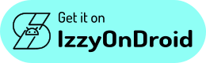

<h1 align="center">
  
   
  Neo Store
  
</h1>

<strong>The modern and feature-rich F-Droid client for everyone!</strong>

  

## Features :abacus:

* UX focused on empowering users :fist:
* Fast repository sync times :airplane: 
* Awesome built-in repositories :toolbox:
* Easy exploration of new apps :mag:
* Minimalism with KISS principles :dart:

### Upcoming plans :eyes: 

We also have a roadmap board on Taiga where you can see our future plans. Feel free to contact us if you'd like to contribute to any of the planned changes.

## Screenshots :framed_picture:

### Available in beautiful light :sun_with_face: and dark :new_moon_with_face: themes. Also with higher contrast or dynamic colors…

|  |  |  |
|:-------------------------------------------------------------------------------------------------------:|:------------------------------------------------------------------------------------------------------:|:--------------------------------------------------------------------------------------------------------:|

### Top downloaded apps, extensive filters & around 100 built-in repos :toolbox:

|  |  |  |
|:-------------------------------------------------------------------------------------------------------:|:------------------------------------------------------------------------------------------------------:|:--------------------------------------------------------------------------------------------------------:|

### Reproducible build labels, privacy panel & comprehensive control over your repos

|  |  |  |
|:----------------------------------------------------------------------------------------------------:|:--------------------------------------------------------------------------------------------------------:| -------------------------------------------------------------------------------------------------------:|

## Community :speech_balloon:

You can join either our [Telegram](https://t.me/neo_android_store) or [Matrix](https://matrix.to/#/#neo-store:matrix.org) groups to make suggestions, ask questions, receive news, install test builds, or just chat.

## Translations :left_speech_bubble: 

Contribute your translations to Neo Store on [Hosted Weblate](https://hosted.weblate.org/engage/neo-store/).   Adding new languages is always accepted and supported.

## Special Thanks :heart:

To [Iamlooker](https://github.com/Iamlooker), who worked with me on maintaining the project, until he had to step away and fork out out of career-related reasons. Best of luck!

To [Donno](https://github.com/Donnnno) for the new app icon base.

### Contributors :handshake:

## Copylefted Libre License :scroll:

Licensed under the [GPLv3+](/COPYING). \
Direct adaptation/modification of [Foxy-Droid](https://github.com/kitsunyan/foxy-droid/).

Copyright © 2025 [Antonios Hazim](https://github.com/machiav3lli) and [contributors](https://github.com/NeoApplications/Neo-Store/graphs/contributors).

